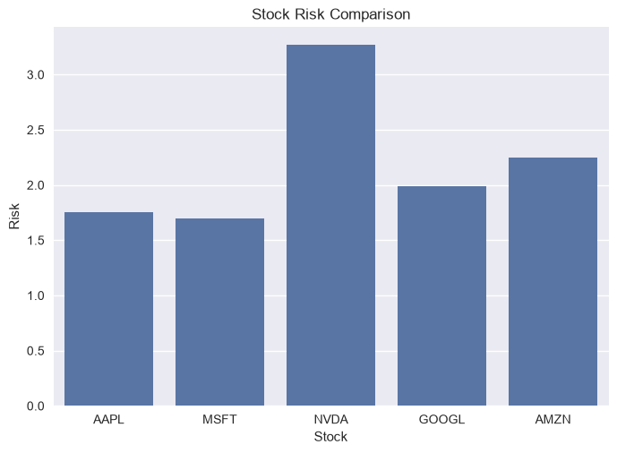
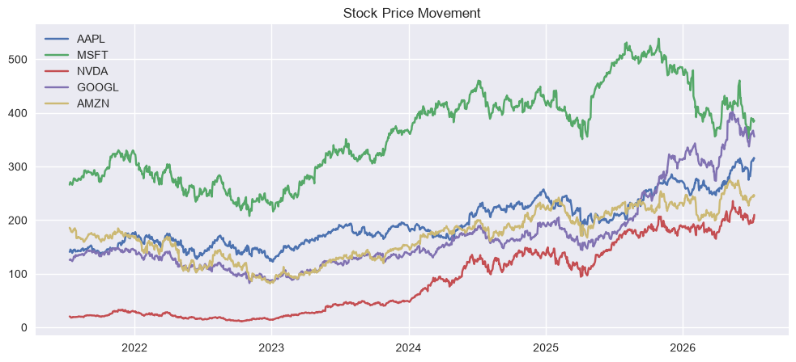
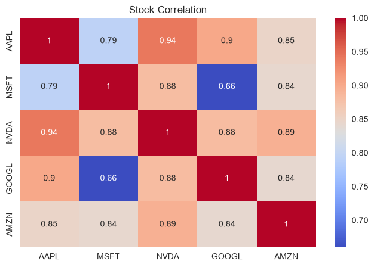

# stock-screener

# Stock Market Analysis

## Overview

This project analyzes stock market data using Python.

The project collects real stock data, cleans it, analyzes performance, visualizes trends, and creates a simple stock ranking system.

The goal is to understand how companies perform based on historical market data and learn basic quantitative finance concepts.

---

# Project Structure

```text
stock-screener/
│
├── main.ipynb
├── README.md
├── requirements.txt
│
└── IMAGES/
    ├── risk_comparison.png
    ├── price_movement.png
    └── correlation_heatmap.png

```

---

# Project Workflow

1. Collect real stock market data
2. Clean and prepare the data
3. Calculate stock growth
4. Measure stock risk using volatility
5. Visualize price movements and comparisons
6. Create a stock ranking system
7. Analyze relationships between stocks

---

# Data Collection

Historical stock prices are downloaded using Yahoo Finance through the `yfinance` library.

Companies analyzed:

* Apple (AAPL)
* Microsoft (MSFT)
* Nvidia (NVDA)
* Google (GOOGL)
* Amazon (AMZN)

The project uses 5 years of historical price data.

---

# Data Cleaning

Financial datasets may contain missing values.

The project removes missing data before performing calculations to ensure accurate analysis.

---

# Stock Performance Analysis

Stock growth is calculated using:

```text
Growth = ((New Price - Old Price) / Old Price) × 100
```

This measures how much each stock increased or decreased over the selected time period.

---

# Growth Comparison

A bar chart is created to compare the performance of different companies.

Example results:

| Stock | Growth % |
| ----- | -------: |
| AAPL  |   120.64 |
| MSFT  |    48.07 |
| NVDA  |   878.93 |
| GOOGL |   195.92 |
| AMZN  |    41.14 |

---

# Risk Analysis

Risk is measured using volatility.

Higher volatility means larger price movements and potentially higher risk.

Formula:

```text
Risk = Standard deviation of daily returns
```

Example results:

| Stock | Risk % |
| ----- | -----: |
| AAPL  |   1.75 |
| MSFT  |   1.70 |
| NVDA  |   3.26 |
| GOOGL |   1.99 |
| AMZN  |   2.25 |

---

# Price Movement Analysis

The project visualizes historical closing prices to observe long-term trends.

This helps compare how companies performed over time.

---

# Stock Ranking Algorithm

Growth and risk are combined to create a simple score.

Formula:

```text
Score = Growth % - Risk %
```

Higher growth with lower risk produces a higher score.

Example ranking:

| Rank | Stock | Growth % | Risk % |  Score |
| ---- | ----- | -------: | -----: | -----: |
| 1    | NVDA  |   878.93 |   3.26 | 875.67 |
| 2    | GOOGL |   195.92 |   1.99 | 193.93 |
| 3    | AAPL  |   120.64 |   1.75 | 118.89 |
| 4    | MSFT  |    48.07 |   1.70 |  46.37 |
| 5    | AMZN  |    41.14 |   2.25 |  38.89 |

---

# Correlation Analysis

The project uses correlation analysis to understand how stock movements are related.

A correlation heatmap is created to visualize relationships between companies.

---

# Visualizations

The project generates visualizations to analyze stock performance and relationships.

## Risk Comparison

Shows the volatility of each stock. Higher values indicate larger price movements and higher risk.



---

## Price Movement

Shows historical stock price trends over the selected period.



---

## Correlation Heatmap

Shows how stock price movements are related to each other.



---

# Business Insights

From this analysis:

* Different companies show different growth patterns.
* Higher returns can come with higher volatility.
* Historical data can help compare company performance.
* Data-driven analysis is useful for understanding market behavior.

---

# Future Improvements

Possible improvements:

* Add more financial indicators
* Include P/E ratio and market capitalization
* Use advanced risk-adjusted metrics
* Build an interactive dashboard
* Add portfolio optimization features

---

# Disclaimer

This project is created for educational purposes only.

It is not financial advice and should not be considered a recommendation to buy or sell any stock.

---

# Conclusion

This project demonstrates how Python can be used for financial data analysis.

The workflow includes collecting real market data, cleaning datasets, calculating performance metrics, measuring risk, creating visualizations, and building a simple stock ranking model.

It introduces the fundamentals of quantitative investing and data-driven decision making.


# Author
Rajshree Verma
